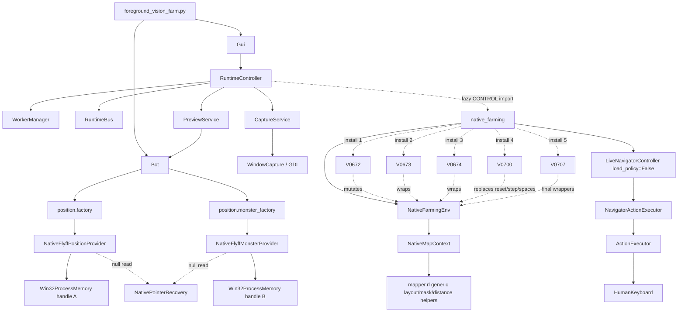

# Import and Dependency Graph

Status: complete (`AUD1-001`, `AUD1-004`).

This graph records both normal imports and runtime mutation. Raw AST-derived
edges are in `evidence/root_import_edges.tsv`; dynamic-install evidence is in
`evidence/root_patch_dynamic_imports.txt`.



## Dynamic edges that static import listings alone miss

1. `RuntimeController` imports `native_farming` only inside the CONTROL worker.
2. Importing `native_farming` mutates class functions globally in the exact
   V0672 -> V0673 -> V0674 -> V0700 -> V0707 order.
3. `Bot` imports minimap heading and native monster-map overlay implementations
   inside preview/overlay calls.
4. `Gui` imports map editing, minimap anchor, asset mutation, and legacy
   calibration helpers inside event handlers.
5. `mapper.__getattr__("Mapper")` resolves to
   `CoordinateMapper.Mapper`; it does not load historical `mapper/Mapper.py`.
6. Asset and map data dependencies are path-based rather than import-based:
   the mob registry, species/name images, eight heading arrows, OCR digits,
   selected Tower map arrays, transform, and previews are live data edges.

## Accidental dependency clusters

- The direct four-action runtime constructs `LiveNavigatorController` only as
  an executor/focus/EVA shell. Its movement PPO is deliberately not loaded,
  but its goal-navigation modules and configuration remain attached.
- `NativeMapContext` and the current observation code import useful generic
  layout, action-mask, travel-cost, and procedural-layout pieces from
  `mapper/rl`, so that package cannot be deleted wholesale. Generic primitives
  must be extracted before removing navigator/offline-training code.
- The configured 482-value model depends on a 261-value legacy observation
  prefix even though target navigation is no longer a product behavior.
- Version patch directories contain installers, copied payloads, and duplicate
  tests, but normal product launch does not import those directories.

## Target dependency direction

```text
app/ui
  -> runtime supervisor + typed event bus
       -> capture / preview / mapping / farming session workers
            -> injected game input, native session, vision, map context
                 -> platform backends and immutable data

farming environment
  -> explicit four-action controller
  -> versioned observation/reward builders
  -> coherent native snapshot + active map context

native session
  -> one process handle + one pointer-state owner
  -> cheap player/actor views
  -> explicit bounded recovery/discovery worker
```

The target has no import-time monkeypatches, no farming dependency on a
movement PPO, and no ordinary read edge to pointer recovery.
